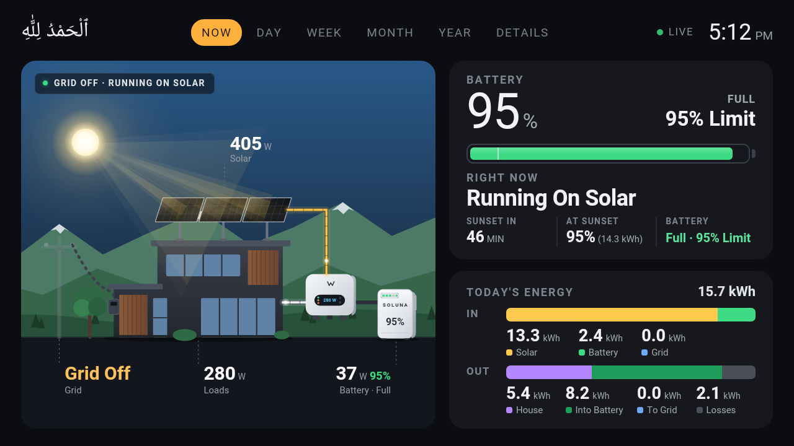
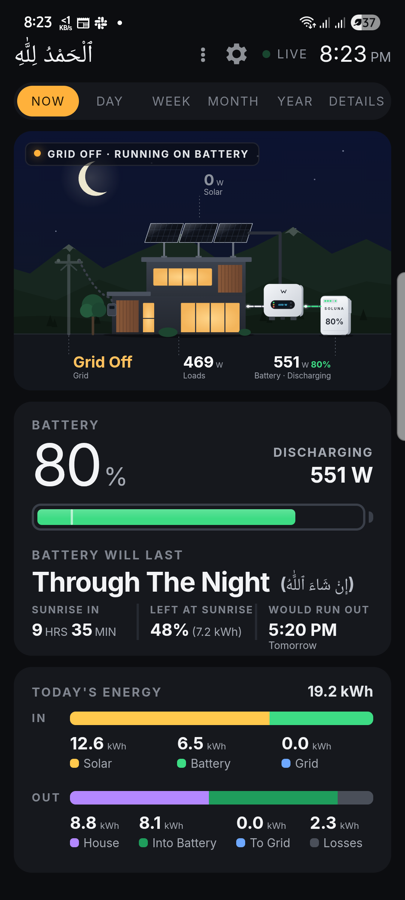
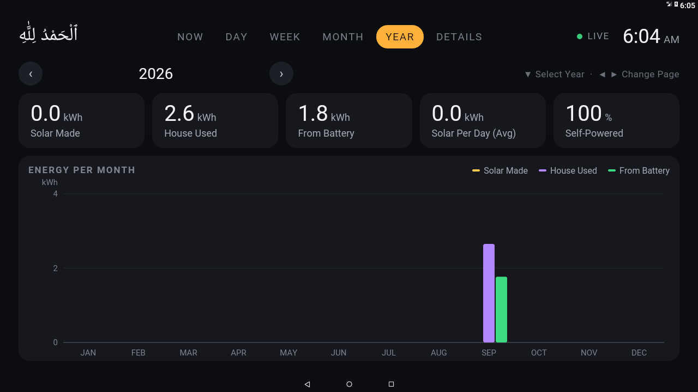

# solard

A small local server and an Android app (QuickSolar) for GoodWe hybrid inverters.
It shows live power flow, battery time left, today's energy and history, using only
your home network. No cloud account is needed.

<p align="center">
  <br>
  
  
</p>

There are two parts:

- `solard`, a single program with no dependencies. It reads the inverter every 5 seconds,
  keeps the history and serves the dashboard at `http://<computer>:8768/`.
- The QuickSolar app, the same dashboard as an app for Android phones and Android TV. It finds
  the inverter and any solard server on the network by itself. It also works without
  solard, showing live data read directly from the inverter but no history.

Both only read from the inverter (Modbus function 0x03). They never change any inverter
or battery setting.

## Install the server

Run this on a computer that stays on and is on the same network as the inverter.

macOS or Linux, in Terminal:

```sh
curl -fsSL https://raw.githubusercontent.com/qazi0/solard/main/install/install.sh | sh
```

Windows, in PowerShell or Windows Terminal:

```powershell
irm https://raw.githubusercontent.com/qazi0/solard/main/install/install.ps1 | iex
```

From Command Prompt use
`powershell -c "irm https://raw.githubusercontent.com/qazi0/solard/main/install/install.ps1 | iex"`.

The installer downloads the program, looks for the inverter and sets it to start
automatically (at login on macOS, at boot on Linux, at sign in on Windows).

- macOS asks once whether solard may find devices on your local network. Click Allow.
- Windows asks once to allow it through the firewall so phones can reach it.
- The computer should not go to sleep, otherwise the history has gaps.
- Run one server per inverter. The inverter's dongle only accepts a few connections at a
  time (three on the tested model), and each server keeps one open.

Nothing needs to be configured. The battery size is entered in the app's setup, or by
clicking "Need Battery Size" on the dashboard in a browser.

Advanced installer options, set as environment variables before the command:
`SOLARD_HOST=192.168.1.50` if the inverter is not found automatically, and
`SOLARD_HTTP=8768` to use another port.

To uninstall on macOS or Linux run the same command with `sh -s -- --uninstall` at the end.
On Windows set `$env:SOLARD_UNINSTALL = "1"` first and run the same command.

## Install the app

Download `QuickSolar-v<version>.apk` from the [latest release](https://github.com/qazi0/solard/releases/latest)
and open it on the phone or TV. The same APK works on every Android phone and Android TV.
Android will ask to allow installing apps from this source.

On first start the app searches the network, lists the inverter and any solard server,
and asks for the battery size. Without a server it shows the NOW, DAY and DETAILS pages.
With a server it also shows WEEK, MONTH and YEAR. If you install solard later, the app
notices it on the next start and offers to switch to it with one tap.

## Supported inverters

GoodWe ET family hybrids: ES, ES Uniq, ET, EH, BT and BH. The register map comes from the
[goodwe](https://github.com/marcelblijleven/goodwe) Python library (`et.py`). The inverter's
WiFi or LAN dongle must answer Modbus/TCP on port 502. The app can also use Modbus over
UDP port 8899, which some older WiFi dongles use. Tested with a GW6000-ES-20.

## How the numbers are calculated

solard adds up the energy itself from every 5 second reading instead of copying the
inverter's daily counters, which only have 0.1 kWh resolution and can be off.

- Solar is PV1 + PV2.
- House is the inverter's total AC output plus any grid import.
- Battery is voltage times current.
- Losses are energy in minus energy out.

The inverter's counters are only used for periods solard did not see, for example before
it was installed. The DETAILS page shows both side by side. The charge limit and the
battery reserve are read from the inverter. The battery size is a setting because
batteries do not report it.

History is stored as one small binary file per day plus `days.csv`, about 70 KB per day.

## Server settings

The settings file is `solard.conf` next to the program. After using the installer it is
`~/.solard/solard.conf` on macOS and Linux and `%LOCALAPPDATA%\solard\solard.conf` on
Windows. Each line is `key = value`.

| key | meaning |
|---|---|
| `host` | inverter address. Found automatically if missing, and found again if it changes. |
| `capacity` | usable battery size in kWh |
| `lat`, `lon` | location used for sunrise and sunset on the dashboard |
| `http` | port for the dashboard and API, default 8768 |
| `port`, `unit` | Modbus port and unit id, default 502 and 0xF7 |
| `data` | folder for the history |
| `utc_offset` | fixed time zone such as `+05:00`. The system time zone is used by default. |

The same settings can be given as environment variables (`SOLARD_HOST` and so on) or as
command line flags (`--host` and so on). `solard --discover` prints what it finds on the
network.

API: `/api/now` (live reading and today's totals), `/api/day?d=YYYY-MM-DD` (one minute
curve for a day), `/api/days?from=YYYYMMDD&to=YYYYMMDD` (daily totals), `/api/config`
and `/ping`.

## Building

```sh
server/build.sh                 # build for this machine, output in dist/
server/build.sh release         # all release binaries, needs cosmocc
python3 android/build.py        # the app, needs a JDK and the Android SDK
python3 tools/fake_inverter.py  # a fake inverter for testing
```

The server is written in C. The Linux and Windows release binaries are built with
[Cosmopolitan libc](https://github.com/jart/cosmopolitan) and the macOS binary with the
system compiler. GitHub Actions builds and tests each release on Linux, macOS and Windows.

## Credits

Made by [Siraj Qazi](https://github.com/qazi0). The register map and scaling come from
[marcelblijleven/goodwe](https://github.com/marcelblijleven/goodwe) (MIT license). The
dashboard uses the [Inter](https://rsms.me/inter/) font (SIL Open Font License 1.1).
This project is not affiliated with GoodWe.

MIT license.
